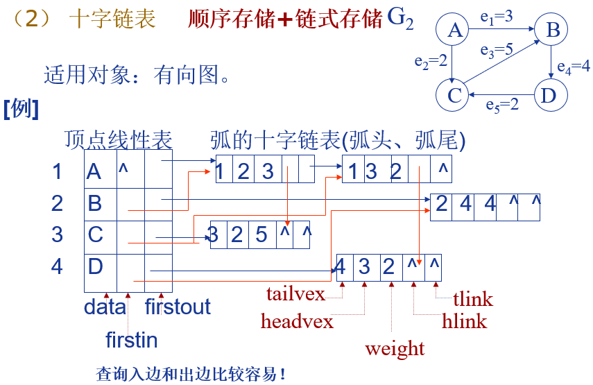
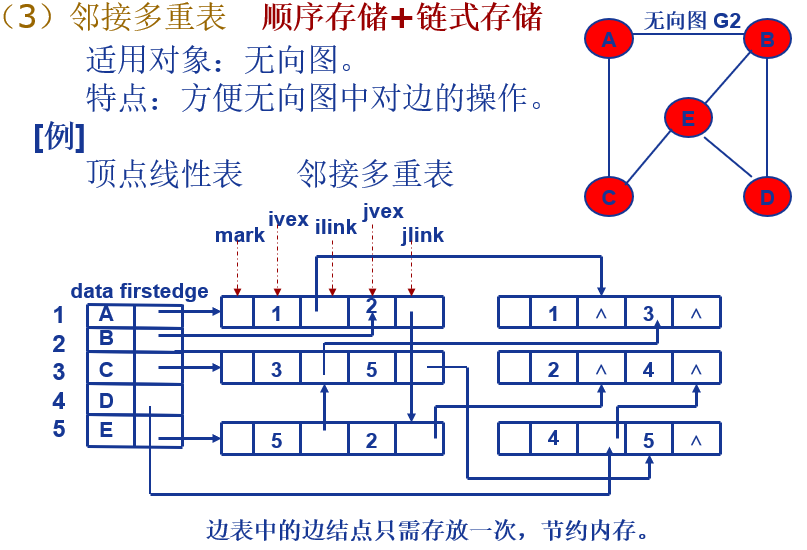
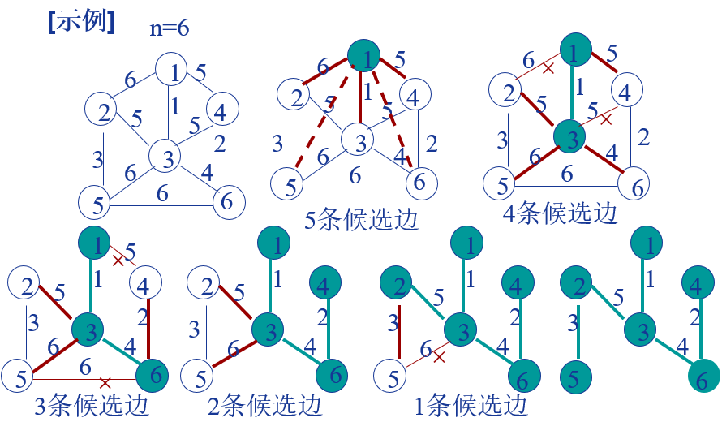
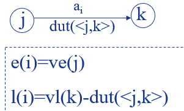
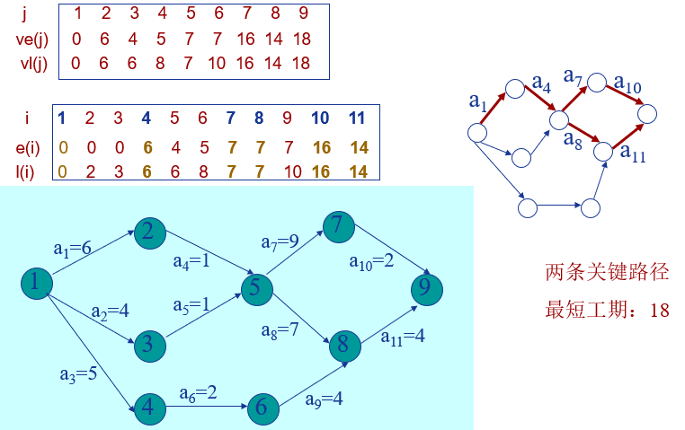
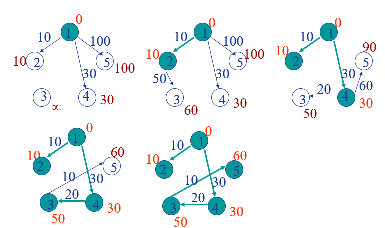
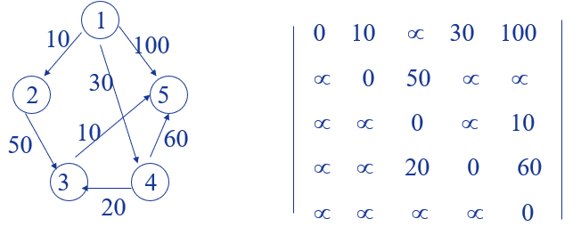
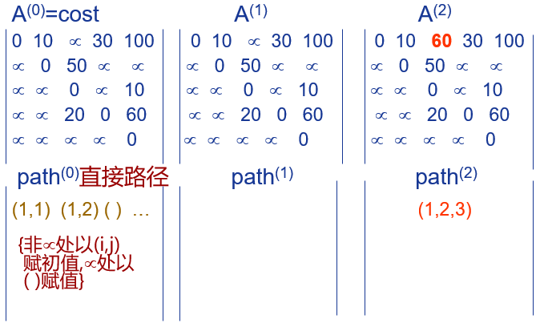

迭代算法

 - 初始化
	 - 迭代次数是否可计算。
	- 要返回什么。
	 - 迭代中需要哪些变量，其初始值是什么。哪些单次迭代后即可销毁，哪些需要在N个迭代间共享，哪些需要全迭代共享。
 - 迭代体
	 - 变量间如何相互作用并发生改变。
	 - 变量的值如何改变并传递给下一次迭代，改变时是否会因为执行到结尾产生错误。
 - 完成点
	 - 若迭代次数不可计算，则需要详细枚举迭代完成时的各种情况进行分析并写出测试用例。


---


### 递归算法

- **递归算法**指一种通过重复将问题分解为同类的子问题而解决问题的方法。

---

### 字符串

https://www.jianshu.com/p/3d07e9a91430

| 问题序号 | 问题内容                 | 思路解法 |
| -------- | ------------------------ | -------- |
| 344, 541 | 反转字符串               |          |
| 3 | 无重复字符的最长子串 |          |
| 14 | 最长公共前缀         |          |


---


### 链表

https://www.jianshu.com/p/d675288f0b81

 - 定义：链表是非连续、非顺序的存储结构，数据元素的逻辑顺序是通过链表中的指针链接次序实现的。
 - 构成：链表由一系列结点组成。每个结点包括两个部分：一个是存储数据元素的数据，另一个是存储下一个结点地址的指针。 
 - 优点：
      - 由于不须按顺序存储，链表在插入和移除时可以达到O(1)的复杂度
      - 使用链表结构可以克服数组链表需要预先知道数据大小的缺点
 - 缺点：
      - 访问特定编号的节点则需要O(n)的时间，而线性表和顺序表相应的时间复杂度分别是O(logn)和O(1)。
      - 链表由于增加了结点的指针，空间开销大。
 - 类型：
     - 单向链表 A1->A2->A3->A4  (A1.next==A2)
     - 双向链表 A1<->A2<->A3<->A4  (A2.prior==A1)
     - 循环链表 A1->A2->A3->A4->A1  (A4.rear==A1)
     - 双循环链表 A1<->A2<->A3<->A4<->A1  (A1.prior==A4 , A4.rear==A1)

| 问题序号 | 问题内容                 | 思路解法 |
| -------- | ------------------------ | -------- |
| 206 | 反转链表               |          |
| 92 | 反转链表 II |          |
| 141 | 环形链表             |          |
| 142 | 环形链表 II          |          |


---

### 小猫钓鱼

- 定义：在字符串中寻找具有XX特征的最长子串。**包含非XX特征子串的字符串也不满足XX特征。**
- 思路：即以元素Str[i]为尾的子串中符合XX特征的子串，并遍历出最长的一个。
- 遍历：增尾，单步加长尾部元素。切头，切除足够多的头部元素使子串符合XX特征。每次增尾去头操作后都是一个符合XX特征的合法子串。此法可以完全遍历。

| 问题序号 | 问题内容                                                     | 思路解法 |
| -------- | ------------------------------------------------------------ | -------- |
|   3       | 无重复字符的最长子串 |          |

---

### 图类问题

- 顶点：顶点的度是 与该顶点相关联的边的数目，记为D(v)
- 入度：有向图中指向该点的弧数目 ID(v)
- 出度：有向图中从该店出发弧数目OD(V)
- 边 e = 1/2 * 所有D(v) 
- **同构：**
  1.两个图的顶点集合之间能够建立一一对应的映射，对应的顶点之间保持边的一一对应关系。
  2.一个图的邻接矩阵经过有限次的互换行或列变换成另一个图的邻接矩阵，两个图同构
- **有向无向图：**
  有向图边<vi, vj>称为  弧
  无向图边(vi, vj)称为  边
- **完全图：**
  每个顶点到其余顶点都有边/弧
- **权重**
- **网：**
  边/弧带权的图
- **简单路径:**
  除了路径起点和终点可以相同之外，其余顶点均不相同的路径
- **最短路径**
- **子图：**
  对于两个图，图一的边是图二边的子集，图一的顶点是图二点的子集，则图一是图二的子图。
- **生成子图：**
  由图的全部顶点和部分边组成的子图成为原图的生成子图
- **生成树：**
  包含图中全部顶点的极小连通子图，包含图中所有n个顶点，但是只有n-1条边，添加一条边之后就会形成回路或者环
- **连通图/连通分量：**
  图中，任意两个顶点之间都存在路径，图是连通图
  n个顶点组成的连通无向图，其边的个数至少为n-1
  不是连通图的图，有多个连通子图，一个图的最大连通子图叫**连通分量**
  一个有n个节点的无向图，最少有(1)个连通分量，最多有(n)个连通分量
  若G是一个非连通无向图，共有28条边，则该图至少有(9)个顶点
  **强连通图**有向图中，任何一对顶点间都存在路径，**强连通分量**是有向图中的极大连通子图

#### 储存方式

##### 1.数组+邻接矩阵/加权邻接矩阵（顺序储存方式）

- **有向图的邻接矩阵**
  图有n个顶点，$n \times n$ 权重矩阵保存边(无权则为0/1)，在用一个 $ n\times1$的数组保存顶
  点
- **无向图的邻接矩阵**
  如上，必然为一个对称矩阵，可以压缩成上三角或者下三角矩阵
  n个顶点的连通图用邻接矩阵表示时,该矩阵至少有2(n-1)个非零元素。
  n个顶点的强连通图用邻接矩阵表示时,该矩阵至少有(n)个非零元素
- **优点**：判断两点之间是否有边方便 O(1)
- **缺点**：储存单元多，遍历费时

##### 2.邻接表（顺序储存+链式储存）

用顶点表和边表保存图

- **顶点表**

  | data | firstarc |
  | ---- | -------- |
  |      |          |

  data：顶点的val
  firstarc：指向从该顶点出发的第一条边的边表地址

- **边表**

  | info | adjvex | nextarc |
  | ---- | ------ | ------- |
  |      |        |         |

  info：边节点的数据，权值等
  adjvex：边界点指针，给出本边依附的另一个顶点
  nextarc：指向从该顶点出发的下一条边的边节点地址，顶点表

- **优点**：内存消耗=顶点数+边数 消耗小

- **缺点**：判断两点之间是否有边慢，最慢O(n),无向图一条边表示两次，浪费（改进：建立邻接
  多重表表示和某个顶点直接相连的有哪些顶点），有向图寻找进入某节点的弧麻烦（改用逆邻接
  表，或十字链表）

- **对缺点的改进**：

  1. **逆邻接表：边表采用入边表**
  2. **十字链表：顺序储存+链式储存（适用有向图）**
     
     tailvex是边的起点，headvex是边的终点，weight权重
     hlink指向同一个终点的另外一条边
     tlink指向同一个起点的另外一条边
  3. **邻接多重表：顺序储存+链式储存（适用无向图）**
     

    注意生成边的顺序，按照1-10的顺序生成

#### 图的遍历

##### 1.深度优先

对已经访问的顶点做标记，因为对邻接顶点的访问是任意的，所以深度优先序列可能有多种

##### 2.广度优先

用队列保存当前访问点周围未访问点，然后依次出队

#### 图的连通性

##### 1.无向图：连通图的生成树&非连通图的生成森林

- BFS生成树树高<=DFS生成树高度
  一个图的生成树不是唯一的（不同点出发，不同储存结构）
- 非连通图有多个连通分量，每一个连通分量遍历时构成一棵树，多个连通分量的生成树组成生成
  森林

##### 2.有向图：强连通分量求法

1. 先DFS这个图，并且依次对出现回溯的点进行编号，第一次出现回溯的点标1，后面++，回溯的
   意思是，这个点周围要么都是已访问的点，要么是没有其他点，只能从队列中弹出，要对所有点都
   编上号。
2. 将这个图的所有边反向
3. while(有点未被访问){
   起点 = 当前编号最大的点
   DFS(起点){标记访问到的每个点}
   生成森林.add(起点)
   }
   生成森林包含了有向图强连通分量的顶点

###### 3.最小生成树

由一个网络(带权图)生成的各边的权数总和最小的生成树叫最小生成树(MST)

1. **Prime算法（稠密图）**
   一个已访问点集合，一个未访问点集合。每次选择一条边，这个边满足两个条件，a.这条边的
   一个点再已访问，另外一个点在未访问；b.这条边是所有符合条件a里面权重最小的
   选择好了边之后，将在未访问集合中的边的顶点放到已访问，直到所有点都被访问
   下面是这个过程的图示：
   
2. **Kruskal算法（稀疏图）**
   1)初始化T：顶点集=所有顶点，每个独立的顶点作为一棵树，边集=ø；                                                         O(n)
   2) 依权值递增序对图G的边排序，结果为E[1..e]    O(elge)
   3) 依次检测E中的各边(u,v)：                                    O(elge)
    3.1) 若u和v分属于T中两棵不同的树，则将该边加入T，并合并u和v分属的两棵树
    3.2) 若T中所有顶点尚未属于一棵树，转3)
   其中3.1这一步，可以用到并查集，[并查集](https://blog.csdn.net/qq_41593380/article/details/81146850)是什么可以看看这篇文章

##### 4.有向无环图的应用（DAG图）

描述工程项目或者系统进行的工具，分成两个网络：
**AOV网络**定义顶点为活动，有向边是执行次序
**AOE网络**定义顶点是时间，单位是时刻。有向边定义为活动，权重是活动进行需要的时间

1. **拓扑排序（AOV）**

- 无前驱的顶点优先算法
  [算法思想]
  1.选择一个入度为0的顶点(无前趋的顶点)，输出它
  2.删去该顶点及其关联的所有出边
  重复上述两步，直至图中不再有入度为0的顶点为止。
  若所有顶点均被输出，则排序成功，
  否则图中存在有向环。
  若该有向图不是无环图，则不存在拓扑排序。可以来判断一个有向图是否存在回路。
- 无后继的顶点优先算法
  和上面很像，只不过出度为0开始，还有其他判断，这里就不多说了

2. **关键路径（AOE）**
   当一个任务可以化成多个子任务，其中的任意子任务都可能是另外一些子任务的先决条件，接下来
   的算法能解决以下两个问题：
   **整个工程至少需要多少时间
   哪些活动是影响进度的关键**

- **相关概念和术语和变量**
  **源点:** 入度为0的顶点，工程的开始点
  **汇点:** 出度为0的顶点，工程的完成点
  **关键路径:** 从源点到汇点的最长路径，关键路径长度=最短工期
  **关键活动:** 关键路径上的活动，e(i)= l(i)关键活动加快可以缩短工期
  **e(i):** 活动a~i~的最早开始时间
  **l(i):** 活动a~i~的最迟开始时间
  **ve(j):** 事件v~j~的最早发生时间
  **vl(j):** 事件v~j~的最迟发生时间
- **关键路径的确定**

1. **求事件V~j~的最早发生时间**
   ve(1) = 0
   ve(j) = max{ve(i)+dut(<i, j>)} i属于j的前驱
   实际上就是根据拓扑排序，更新每一个点的ve(j)=能到达自己这里的最大值
2. **求事件V~j~的最迟发生时间**
   vl(n) = ve(n)
   vl(j) = min{vl(k)-dut(<j,k>)}
   和之前相反，从最末点出发，前面点vl(j)是后一个已知点-过程能得到的最小值
3. **求活动a~i~的最早开始时间e(i)和最迟开始时间l(i)**
   
   注意这里，e(i),l(i)针对的是边，第一个e(i)=的是边的起始点的ve(i)
   l(i)等于的是到达点的vl(k)-dut
4. **确定关键路径**
   关键活动是e(i)=l(i)的边
    

#### 最短路径

##### 1.单源最短路径（迪杰斯特拉算法）


主：邻接矩阵G[n][n] (或者邻接表)
辅：
一维数组S[1..n]：记录相应顶点**是否已被确定最短距离**
一维数组D[1..n]：记录**源点**到**相应顶点**路径长度
一维数组P[1..n]：记录相应顶点的双亲顶点
算法步骤：
设确定v为源点
1)初始化辅助数据结构：(i=1..n)                                O(n)
  1.1)  S[i]=FALSE；
  1.2)  D[i]=G[v][i]；
  1.3)  若D[i]不为无穷（无穷表示不能到达），则P[i]=v，否则P[i]=-1
2)确定源点自身的最短距离: S[v]=TRUE, D[v]=0     O(1)
3)循环确定其余n-1个顶点到v的最短距离：            O(n2)
   3.1)找出D中未被确定最短距离的顶点中路径最短的顶点，
          设该顶点序号为k，且D[k]=min；
   3.2)若min为无穷，退出本算法；
   3.3)赋值S[k]=TRUE；
   3.4)调整尚未被确定最短距离的顶点的估算距离：(j=1..n)
           若S[j]=FALSE 且 D[j]>D[k]+G[k][j]
           则D[j]=D[k]+G[k][j]，P[j]=k
4)依次打印各顶点的最短路径及其距离：                    O(n2)
   (i=1..n)
   4.1)printf(i，D[i])；
   4.2)确定终点i的前趋：pre=P[i]
   4.3)若pre=-1，则转4)处理下一顶点
          否则printf(pre)，pre=P[pre]，转4.3)

##### 2.每一对顶点间的最短路径（弗洛伊德算法）

可以每次选一个顶点作为源点，然后反复利用迪杰斯特拉算法，需要O(n^3^)
算法思想：
利用二维数组A(1..n, 1..n), A[i, j]记录当前vi到vj的最短路径长度，初值A[i, 
j]=cost[i, j]
集合S记录当前允许的中间顶点，初值S=
依次向S中加入v1、 v2、...、 vn，每加入一个顶点，对A[i, j]进行一次修正：设S={v1, 
v2,..., vk-1}，加入vk，则A(k) [i, j]=min{A(k-1) [i, j],  A(k-1) [i, k]+ 
A(k-1) [k, j]}
    A(k) [i, j] 的含义： 允许的中间
             顶点的序号最大为k时的
             从vi到vj的最短路径长度




---

### 动态规划法

> 动态规划能够遍历所有解空间并避免重复计算。避免了回溯算法的重复计算。
> 

 - 适用问题：无后效性、重复子问题。
 - 问题类型：
    - 求最优解
    - 求解空间大小。
 - 思维模式：
    - 首先正向思维。用回溯法枚举出解空间。（最优解问题要善用假设缩小解空间）
    - 回溯过程分析。判读是否存在中间状态，同一个中间状态是否出现在了多个解中，多个重复的中间状态间相同的状态可以用什么参数描述。
    - 状态转移分析。用DP(arg)函数定义中间状态,（当arg为某值时，最优解DP为../解空间大小DP为...），并用DP转移方程描述状态间的关系（当arg发生变化时，DP会发生什么变化）。
    - 初始状态分析。绘制状态转移表。
    - 状态转移优化。绘制状态转移流程图。单个arg时，状态转移为一条单链表。多个arg时，状态应呈现树状。判断状态转移顺序（是各个参数嵌套还是同步递增）

| 问题序号           | 问题内容                                                     | 思路解法                                                     |
| ------------------ | ------------------------------------------------------------ | ------------------------------------------------------------ |
| 70, 746            | 爬楼梯问题：假设你正在爬楼梯。需要 n 阶你才能到达楼顶。每次你可以爬 1 或 2 个台阶。你有多少种不同的方法可以爬到楼顶呢？ | 正向思考，每一次选择都是二选一`steps+=1`或`steps+=2`，做k次选择直到`steps==n`，最后计算方法数。这是回溯法，也称试探法，枚举地尝试每一种可能性。我们发现解空间里存在大量相同的部分。所以我们尝试使用逆向思维。到达楼顶最后一步必是n-2或n-1，所以K^n^=K^n-1^+K^n-2^。在我最后一次爬楼梯时我不关心你前面具体怎么爬的，告诉我你爬了多少种就可以了。 |
| 62, 63, 980        | 不同路径问题：一个机器人位于一个 m x n 网格的左上角。机器人每次只能向下或者向右移动一步。机器人试图达到网格的右下角，有多少条路径。 | 思路：这个问题和爬楼梯类似。使用回溯法依旧可以完美地解出问题。但是同样的，解空间里重复性过高。尝试逆向思维。到达终点要么是向下要么是向右，即K^i,j^=K^i-1,j^+K^i,j-1^。同时将（i，j）为障碍的K置0即可。 |
| 72, 161            | 编辑距离：给定两个单词 word1 和 word2，计算出将 word1 转换成 word2 所使用的最少操作数 。你可以对一个单词进行如下三种操作：插入一个字符，删除一个字符，替换一个字符 | 这个问题上来就让人摸不着头脑，万能回溯法似乎不好使。果断逆向思考。我们假设DP(i,j)为wordA的前i位与wordB的前j位相同的情况下最少的操作次数。那么DP(i,j)=1+Math.min(DP(i,j+1), DP(i-1,j), DP(i-1,j-1)) (WA^i^ !== WB^j^) DP(i,j)=DP(i-1, j-1) (WA^i^ === WB^j^)。 |
| 121, 122, 123, 188 | 买卖股票的最佳时机IV：给定一个数组，它的第 i 个元素是一支给定的股票在第 i 天的价格。设计一个算法来计算你所能获取的最大利润。你最多可以完成 k 笔交易。注意: 你必须在再次购买前出售掉之前的股票。 | 这个问题上来就让人摸不着头脑，万能回溯法似乎不好使。果断逆向思考。在i日第k笔卖出的最优收益是i日前某日进行的第k笔买入时的最优收益加上i日股价。i日k笔买入的最优收益是i日前某日第k-1笔卖出时收益减去i日股价。 |


---

### 背包问题

https://www.jianshu.com/p/d9a0624c05e7

| 问题序号 | 问题内容   | 思路解法 |
| -------- | ---------- | -------- |
| 332, 518 | 零钱兑换   |          |
| 474      | 一和零     |          |
| -        | 01背包问题 |          |
| -        | 完全背包   |          |
| -        | 多重背包   |          |


---


### 分治法

 - 分解（Divide）：将原问题分解成一系列子问题；
 - 解决（conquer）：递归地解各个子问题。若子问题足够小，则直接求解；
 - 合并（Combine）：将子问题的结果合并成原问题的解。

| 问题序号 | 问题内容                                                     | 思路解法                 |
| -------- | ------------------------------------------------------------ | ------------------------ |
| 23       | [合并K个排序链表](https://leetcode-cn.com/problems/merge-k-sorted-lists/) | 两两合并逐渐减小问题规模 |
| 50       | Pow(x, n)                                                    |                          |
| 169, 229 | 通过次数求众数                                               |                          |


---

### 贪心算法

https://www.jianshu.com/p/1e1a9a81bbc0

| 问题序号 | 问题内容       | 思路解法 |
| -------- | -------------- | -------- |
| 860      | 柠檬水找零     |          |
| 135      | 分发糖果       |          |
| 330      | 按要求补齐数组 |          |


---

### 哈希表

https://www.jianshu.com/p/d3a48852d5e3

 - 对数组进行分类时，可以采用哈系表来表达分类结果。

| 问题序号 | 问题内容         | 思路解法 |
| -------- | ---------------- | -------- |
| 1        | 两数之和         |          |
| 242      | 有效的字母异位词 |          |
| 15       | 三数之和         |          |


---

### 优先队列

https://www.jianshu.com/p/1bedaee726da

| 问题序号 | 问题内容                | 思路解法 |
| -------- | ----------------------- | -------- |
| 703 | 数据流中的第K大元素 |          |
| 239 | 滑动窗口最大值      |          |
| 692 | 前K个高频单词      |          |


---

### 栈和队列

https://www.jianshu.com/p/e231c0d3c05e

| 问题序号 | 问题内容       | 思路解法 |
| -------- | -------------- | -------- |
| 20 | 有效的括号 |          |
| 739 | 每日温度   |          |
| 394 | 字符串解码 |          |


---

### 树

https://www.jianshu.com/p/47e632985f11

- **树**是一种数据结构，它是由n>=1个有限结点组成一个具有层次关系的集合。没有父结点的结点称为根结点；每一个非根结点有且只有一个父结点；除了根结点外，每个子结点可以分为多个不相交的子树。

- **二叉树**是每个结点最多有两个子树的树结构。通常子树被称作“左子树”（left subtree）和“右子树”（right subtree）。二叉树常被用于实现二叉搜索树和二叉堆。

- **二叉搜索树**是具有下列性质的二叉树： 若它的左子树非空，则其所有结点的值均小于它的根结点的值； 若它的右子树非空，则其所有结点的值均大于它的根结点的值； 任意节点第左、右子树也是二叉搜索树。

- 一些经典的二叉树问题：

  - 二叉树前序遍历
    - 递归，按照**根-左-右**的方式递归。
    - 迭代，见代码。
    ```javascript
    var preorderTraversal = function(root){
        let treeStack = []
        let res = []
        while(root || treeStack.length){
            while(root){
                res.push(root.val)
                treeStack.push(root)
                root = root.left
            }
            if(treeStack.length){
                root = treeStack.pop()
                root = root.right
            }
        }
        return res
    }
    ```
    
  - 二叉树的中序遍历
  
    - 递归，按照**左-根-右**的方式递归。
    - 迭代，见代码。
    ```javascript
    var inorderTraversal = function(root){
        let treeStack = []
        let res = []
        while(root || treeStack.length){
            while(root){
                treeStack.push(root)
                root = root.left
            }
            if(treeStack.length){
                root = treeStack.pop()
                res.push(root.val)
                root = root.right
            }
        }
        return res
    }
    ```
    
  - 二叉树的后序遍历
  
    - 递归，按照**左-右-根**的方式递归。
    - 迭代，见代码。
    ```javascript
    var postorderTraversal = function(root) {
        if(!root) return []
        let treeStack = [root]
        let res = []
        let pre
        while(treeStack.length){
            root = treeStack[treeStack.length - 1]
            if((!root.left && !root.right) || (pre &&(pre == root.left || pre == root.right))){
                res.push(root.val)
                treeStack.pop()
                pre = root
            }else{
                if(root.right) treeStack.push(root.right)
                if(root.left) treeStack.push(root.left)
            }
        }
        return res
    }
    ```
  

| 问题序号 | 问题内容                 | 思路解法                                         |
| -------- | ------------------------ | ------------------------------------------------ |
| 226      | 二叉树翻转               | 用前序遍历对各节点的子节点进行翻转               |
| 144      | 二叉树前序遍历           | 递归，按照**根-左-右**的方式递归。               |
| 94       | 二叉树的中序遍历         | 递归，按照**左-根-右**的方式递归。               |
| 145      | 二叉树的后序遍历         | 递归，按照**左-右-根**的方式递归。               |
| 102, 107 | 二叉树的层次遍历         |                                                  |
| 987      | 二叉树的垂序遍历         |                                                  |
| 98       | 验证二叉搜索树           |                                                  |
| 110      | 验证平衡二叉树           | 递归，每个节点满足（左<=根）且（右>=根）则成立。 |
| 236      | 二叉树的最近公共祖先     |                                                  |
| 235      | 二叉搜索树的最近公共祖先 |                                                  |
| 538      | 搜索树转累加树           | 递归，按照**右-根-左**的方式递归。               |


### 二分法

| 问题序号 | 问题内容         | 思路解法                                           |
| -------- | ---------------- | -------------------------------------------------- |
| 35       | 搜索插入位置     | 二分法                                             |
| 33       | 搜索旋转排序数组 | 二分法，这题可以通过异或操作简化代码，但是烦的起飞 |
